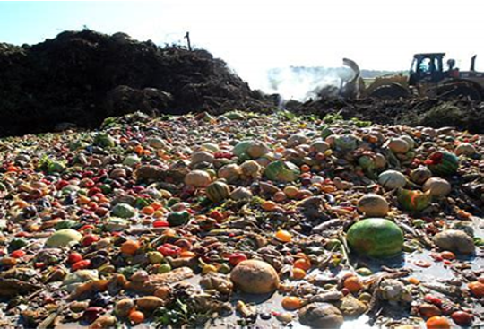

 
# Valorise-website
The first source of presentation online for Valorise ltd
We are developing a resource for businesses that are interested in valorising their waste streams and demonstrating their commitment to sustainability

### VALUE
We create opportunities to exploit agri-food waste as a source of raw materials and high value chemicals generating novel revenue streams.

### About
Our mission is to help businesses valorise their waste and generate additional revenue

### Find us

Address
1 Concept Business Centre,

Kettlestring Lane

York, UK

YO30 4XF

Hours
Monday–Friday: 9:00AM–4:30PM

 
